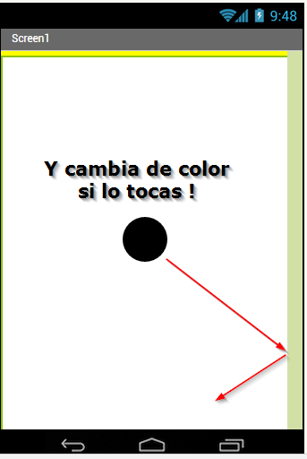

# M1 Mi primer programa

Vamos a crear una sencilla APP será nuestro primer contacto, aprenderemos a entrar en el entorno de APP Inventor, probar nuestras APPs y exportarlas para ejecutarlas en otro móvil.

