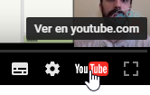

# Objetivo

¿qué es lo que vamos a hacer? ... un sencillo programa para romper el hielo, y saber cómo manejar APP Inventor, el objetivo no es la programación sino entender el entorno.

- Entender bien interfaces diseño y bloque
- Probar nuestra APP en tu móvil o tableta
- Exportar nuestra APP a otro móvil o tableta por email

Por cierto, recomendamos **ver los vídeos más grandes** (pincha en ver en Youtube y lo verás en otra web)

<iframe width="560" height="461" src="//www.youtube.com/embed/Jebv6S4bmXs" frameborder="0"></iframe>

